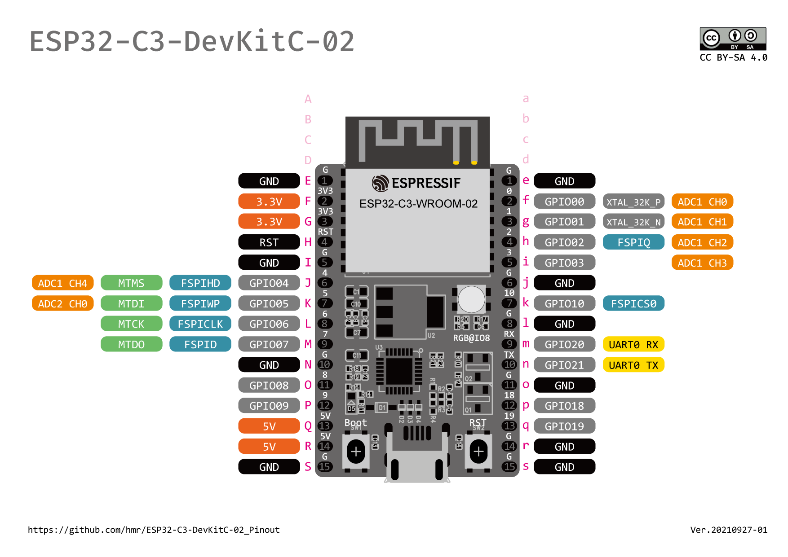
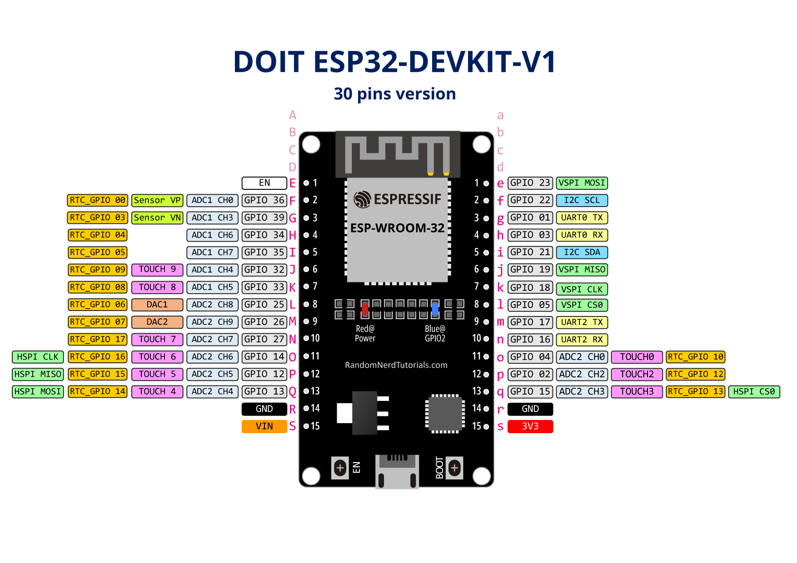
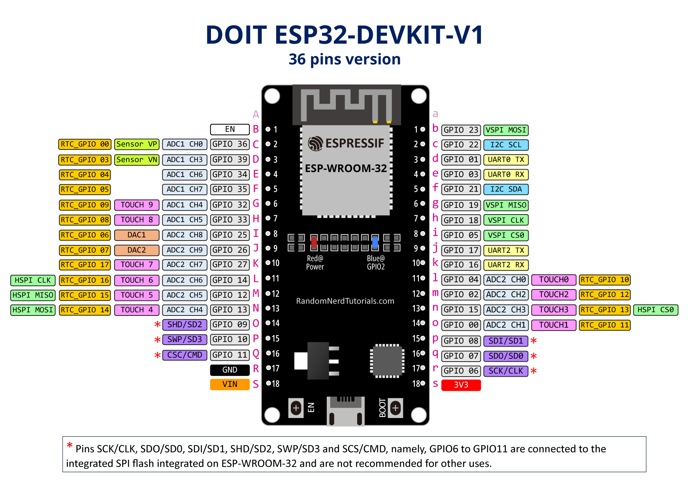

# ESP32-* evaluation board pinout diagrams

## Espressif ESP32-C3-DevKitC-02

- [PNG version](espressif/ESP32-C3-DevKitC-02_Pinout.png)
- [PDF version](espressif/ESP32-C3-DevKitC-02_Pinout.pdf)
- [Adobe Illustrator version](espressif/ESP32-C3-DevKitC-02_Pinout.ai)

## DOIT ESP32-DEVKIT-V1(30 pins version)

- [PNG version](doit/DOIT-ESP32-DEVKIT-V1-30pins-Pinout.png)
- [PDF version](doit/DOIT-ESP32-DEVKIT-V1-30pins-Pinout.pdf)
- [Adobe Illustrator version](doit/DOIT-ESP32-DEVKIT-V1-30pins-Pinout.ai)

## DOIT ESP32-DEVKIT-V1(36 pins version)

- [PNG version](doit/DOIT-ESP32-DEVKIT-V1-36pins-Pinout.png)
- [PDF version](doit/DOIT-ESP32-DEVKIT-V1-36pins-Pinout.pdf)
- [Adobe Illustrator version](doit/DOIT-ESP32-DEVKIT-V1-36pins-Pinout.ai)
